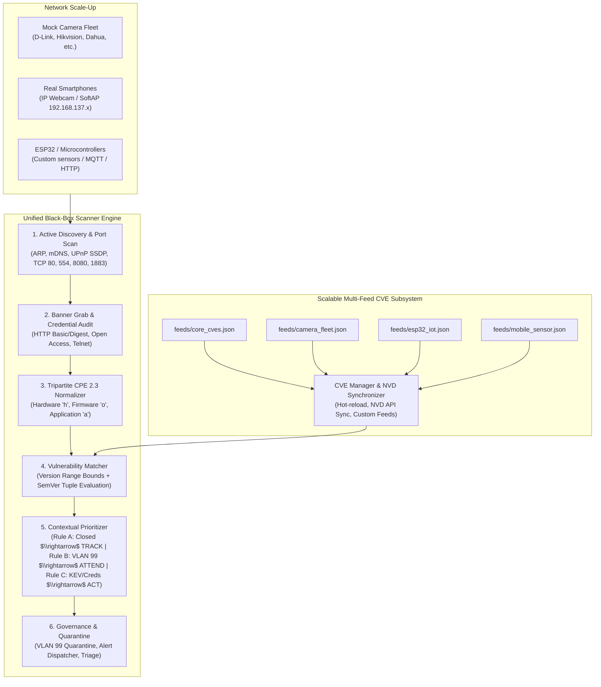

# Insecure IoT Device Detection & Management Platform

**Course**: IT6027 - Cybersecurity Policy and Governance  
**Project Topic**: System for detecting insecure IoT devices within a network  
**Version**: `v0.2.0`  
**Test Suite**: **88 Passing Automated Tests** (`python -m pytest net-sec/tests mock-object/tests -v`)

---

## 1. System Overview & Syllabus Mapping

This platform provides an end-to-end IoT testing environment and an independent security auditing system strictly designed for **IoT edge networks** (IP cameras, mobile sensors, microcontrollers, smart plugs, and IoT brokers). It strictly satisfies all course requirements, combining active protocol discovery with non-destructive vulnerability correlation, tripartite CPE 2.3 normalization, contextual exploitability prioritization (CISA SSVC & VEX), declarative security policies, auditor triage workflows, and zero-trust micro-segmentation.

| Requirement Category | Syllabus Item | Implementation Module | Technical Mechanism |
| :--- | :--- | :--- | :--- |
| **Mandatory** | **IoT Device Fingerprinting** | [`net-sec/app/discovery/`](file:///d:/_work/_hust/IT6027%20-%20Cyber%20Security/iot-system/net-sec/app/discovery/) & [`scoping/classifier.py`](file:///d:/_work/_hust/IT6027%20-%20Cyber%20Security/iot-system/net-sec/app/scoping/classifier.py) | Multi-vector fingerprinting: Service banner grabbing (HTTP/RTSP/Telnet/MQTT), mDNS Zeroconf listening, UPnP SSDP M-SEARCH XML parsing, IEEE OUI MAC vendor mapping. Classifies IP Cameras, Mobile Sensors, Smart Plugs, Gateways, and Microcontrollers. |
| **Mandatory** | **Firmware / CVE Matching** | [`app/audit/cpe_normalizer.py`](file:///d:/_work/_hust/IT6027%20-%20Cyber%20Security/iot-system/net-sec/app/audit/cpe_normalizer.py), [`cve_manager.py`](file:///d:/_work/_hust/IT6027%20-%20Cyber%20Security/iot-system/net-sec/app/audit/cve_manager.py), [`cve_matcher.py`](file:///d:/_work/_hust/IT6027%20-%20Cyber%20Security/iot-system/net-sec/app/audit/cve_matcher.py) | **Tripartite NIST CPE 2.3 Normalizer**: Emits Hardware (`h`), Firmware/OS (`o`), and Application (`a`) candidates with alias dictionary denoising. Correlates against scalable multi-feed CVE database with SemVer tuple bound evaluation and CVSS v3.1 scoring. |
| **Mandatory** | **Default Password Auditing** | [`app/audit/credential_checker.py`](file:///d:/_work/_hust/IT6027%20-%20Cyber%20Security/iot-system/net-sec/app/audit/credential_checker.py) | Non-destructive authentication verifier testing against predefined credential dictionaries ([`default_passwords.txt`](file:///d:/_work/_hust/IT6027%20-%20Cyber%20Security/iot-system/net-sec/app/audit/default_passwords.txt)) across HTTP Basic/Digest (RFC 7616), RTSP, Web Forms, and backdoor accounts (Dahua `7ujMko0vizxv`). |
| **Bonus** | **Contextual Prioritization** | [`app/audit/contextual_prioritizer.py`](file:///d:/_work/_hust/IT6027%20-%20Cyber%20Security/iot-system/net-sec/app/audit/contextual_prioritizer.py) | **CISA SSVC & VEX Engine**: Evaluates active port reachability and network context (Rule A: Closed Port $\rightarrow$ `TRACK` / safe to "live with", Rule B: Quarantine VLAN $\rightarrow$ `ATTEND`, Rule C: CISA KEV / Default Creds $\rightarrow$ `ACT` quarantine). |
| **Bonus** | **Declarative Policy Engine** | [`app/audit/policy_engine.py`](file:///d:/_work/_hust/IT6027%20-%20Cyber%20Security/iot-system/net-sec/app/audit/policy_engine.py) & [`policies/`](file:///d:/_work/_hust/IT6027%20-%20Cyber%20Security/iot-system/net-sec/policies/) | Human-readable YAML governance policies ([`iot_hardening_rules.yaml`](file:///d:/_work/_hust/IT6027%20-%20Cyber%20Security/iot-system/net-sec/policies/iot_hardening_rules.yaml)) validated by JSON Schema ([`policy_schema.json`](file:///d:/_work/_hust/IT6027%20-%20Cyber%20Security/iot-system/net-sec/policies/policy_schema.json)), checking password exposure, cleartext Telnet, open video feeds, and anonymous MQTT against ETSI EN 303 645 & NIST IR 8259A. |
| **Bonus** | **Auditor Triage Workflow** | [`app/audit/triage.py`](file:///d:/_work/_hust/IT6027%20-%20Cyber%20Security/iot-system/net-sec/app/audit/triage.py) | Governance audit workflow enabling security analysts to review findings, approve violations, mark false positives, or suppress alerts with mandatory auditor notes, VEX statuses, and SSVC action priorities. |
| **Bonus** | **VLAN Micro-Segmentation** | [`app/scoping/vlan_scoper.py`](file:///d:/_work/_hust/IT6027%20-%20Cyber%20Security/iot-system/net-sec/app/scoping/vlan_scoper.py) | Zero-Trust dynamic policy enforcement table mapping subnets to VLANs (Hotspot WLAN, Standard IoT VLAN 10, Quarantine VLAN 99). Evaluates isolation policies for compromised endpoints. |
| **Bonus** | **Real-Time Alerts & Webhooks** | [`app/monitoring/alert_dispatcher.py`](file:///d:/_work/_hust/IT6027%20-%20Cyber%20Security/iot-system/net-sec/app/monitoring/alert_dispatcher.py) | Immediate alert streaming and outbound JSON webhook notifications (Slack, Discord, Syslog) triggered on Critical/High risks, CISA KEV entries, and default password detections. |
| **Bonus** | **Responsive Web Dashboard** | [`net-sec/app/web/`](file:///d:/_work/_hust/IT6027%20-%20Cyber%20Security/iot-system/net-sec/app/web/) | Modern Tailwind CSS dashboard with vertical sidebar navigation, real-time device cards, interactive SVG network topology map, live video preview, scan pipeline stage tracking, and academic report generator. |

---

## 2. Repository Layout

```
iot-system/
├── _antigravity/                          # Requirements and draft specifications
│   ├── CVE_draft.md                       # Proposed CVE lifecycle process specification
│   ├── project_draft.md                   # Architectural & technical specification
│   └── project_requirements.md            # Course requirements & grading rubrics
├── docker-compose.yml                     # Multi-VLAN container orchestrator (Auditor + Camera Fleet + MQTT)
├── mock-object/                           # Modular Camera Mock Subsystem & Fleet Manager
│   ├── README.md                          # Camera fleet scaling and profile customization guide
│   ├── fleet_manager.py                   # High-level CLI (start-fleet, stop, list, profiles, generate-compose)
│   ├── docker-compose.template.yml        # Multi-VLAN Compose template for isolated testing
│   ├── engine/                            # Modular camera simulation engine
│   │   └── camera_server.py               # Multi-protocol server (HTTP Basic/Digest, RTSP 554, SSDP, mDNS)
│   ├── profiles/                          # Declarative JSON camera profiles
│   │   ├── dlink_dcs932l.json             # GoAhead-Webs/2.5, Basic Auth, CVE-2020-25078
│   │   ├── hikvision_ds2cd.json           # App-webs, Digest Auth, CVE-2021-36260
│   │   ├── dahua_ipc.json                 # Dahua-Webs, backdoor creds, CVE-2016-10372
│   │   ├── open_access_cam.json           # Unauthenticated live video stream (ETSI EN 303 645 violation)
│   │   ├── ip_webcam.json                 # Android smartphone camera sensor emulation
│   │   └── hardened_cam.json              # Compliant enterprise baseline (unique strong credentials)
│   ├── templates/camera-mock/             # Standalone container template for camera emulation
│   │   ├── Dockerfile
│   │   └── camera_server.py               # Backward-compatible wrapper
│   └── tests/                             # Camera mock automated unit tests (8 tests)
│       └── test_camera_mock.py
├── net-infrastructure/                    # Physical edge network setup
│   ├── setup_hotspot.ps1                  # PowerShell helper for Windows Mobile Hotspot (192.168.137.0/24)
│   ├── hotspot_guide.md                   # Setup guide for Wi-Fi AP & student smartphones
│   └── network_diagnostics.py             # Interface & ARP discovery diagnostic tool
├── net-core/                              # Core IoT services
│   ├── mosquitto/                         # Mosquitto MQTT broker configuration & runner
│   │   ├── mosquitto.conf
│   │   └── run_mosquitto.ps1
│   ├── iot_gateway.py                     # Central HTTP/MQTT telemetry registry & hub
│   └── Dockerfile                         # Lightweight container for IoT Gateway
├── net-sec/                               # Security Auditor & Governance Dashboard
│   ├── Dockerfile                         # Production container for Security Auditor
│   ├── requirements.txt
│   ├── run_scanner.py                     # Unified CLI & Web dashboard launcher
│   ├── policies/                          # Declarative governance policies
│   │   ├── iot_hardening_rules.yaml       # Compliance rules (ETSI EN 303 645, NIST IR 8259A)
│   │   └── policy_schema.json             # JSON Schema validator for policies
│   ├── app/
│   │   ├── scanner_engine.py              # Central orchestrator with 7-stage pipeline tracking
│   │   ├── discovery/                     # mDNS listener, UPnP scanner, port scanner, banner grabber, OUI
│   │   ├── audit/                         # Security auditing subsystem
│   │   │   ├── cpe_normalizer.py          # Tripartite CPE 2.3 normalizer (h, o, a) & SemVer evaluator
│   │   │   ├── cve_manager.py             # Scalable multi-feed CVE manager & NVD synchronizer
│   │   │   ├── cve_matcher.py             # Correlates CPEs & banners against multi-feed database
│   │   │   ├── contextual_prioritizer.py  # CISA SSVC & VEX exploitability evaluation (Rules A, B, C)
│   │   │   ├── credential_checker.py      # Non-destructive HTTP Basic/Digest, RTSP, and form auditor
│   │   │   ├── default_passwords.txt      # Predefined IoT password dictionary & backdoor credentials
│   │   │   ├── policy_engine.py           # Declarative YAML compliance auditor
│   │   │   ├── triage.py                  # Auditor finding governance & sign-off ledger
│   │   │   └── feeds/                     # Modular vulnerability feeds directory
│   │   │       ├── camera_fleet.json      # Camera CVEs (D-Link, Hikvision, Dahua, Xiongmai, TBK)
│   │   │       ├── core_cves.json         # Realtek UPnP SOAP, TP-Link SmartPlug, Mosquitto MQTT
│   │   │       ├── esp32_iot.json         # Espressif ESP32 HTTP overflow & BLE negotiation
│   │   │       └── mobile_sensor.json     # Android IP Webcam frame disclosure
│   │   ├── scoping/                       # Device Classifier, VLAN Scoper, CIDR Scope Service
│   │   ├── monitoring/                    # Real-time Alert & Webhook Dispatcher
│   │   └── web/                           # FastAPI server & responsive Web Dashboard
│   │       ├── api.py                     # RESTful API (/api/scan, /api/cve, /api/triage, /api/report)
│   │       └── static/index.html          # Vertical sidebar UI with SVG topology & triage tables
│   └── tests/                             # Comprehensive automated test suite (76 tests)
└── README.md
```

---

## 3. Quick Start & Execution Instructions

### Primary Method: All-in-One Execution (`python run.py`)

The platform provides a **single unified entrypoint** that launches the local testbed mock fleet, opens the security audit engine, and serves the SOC dashboard with zero port collisions and automated teardown:

```powershell
# 1. Install prerequisites (Python 3.10+)
pip install -r net-sec/requirements.txt

# 2. Run the unified all-in-one platform
python run.py
```

Open **[http://localhost:8000](http://localhost:8000)** in your browser.

**What happens automatically:**
1. Spawns 4 heterogeneous mock camera nodes on loopback multi-IPs (`127.0.0.2` to `127.0.0.5`) on real default ports (`80`, `8080`, `554`).
2. Starts the SOC Web Dashboard and API on `http://localhost:8000`.
3. Defaults audit scope to `ALL` — simultaneously sweeping both physical edge hotspot devices (`192.168.137.0/24`) and virtual testbed cameras.
4. Pressing `Ctrl+C` cleanly shuts down all background camera processes and the web server.

#### Optional Flags for `run.py`:
| Command | Description |
| :--- | :--- |
| `python run.py` | Full interactive SOC dashboard with 4 mock camera nodes (default). |
| `python run.py --scan` | One-shot CLI audit of all targets with full vulnerability report output. |
| `python run.py --no-fleet` | Pure physical mode (audits only physical smartphones / ESP32 on Hotspot). |
| `python run.py --cameras 6` | Scale virtual mock testbed to 6 heterogeneous nodes. |
| `python run.py --port 8080` | Bind web dashboard to custom port. |
| `python run.py --target 192.168.137.0/24` | Restrict audit to a single designated CIDR or device IP. |

---

### Alternative Method: Docker Compose Multi-VLAN Execution

To spin up the Security Auditor dashboard, the Mosquitto MQTT broker, and the heterogeneous Camera Fleet simultaneously across isolated Docker subnets (`172.28.10.0/24` for standard IoT and `172.28.99.0/24` for quarantine):

```powershell
# Build and run all services in background
docker compose up --build -d
```

- **Auditor Web Dashboard**: `http://localhost:8000`
- **Mosquitto MQTT Broker**: `localhost:1883`
- **View Container Logs**: `docker compose logs -f`
- **Stop Containers**: `docker compose down`

---

### Auditing Real Physical Devices (Smartphones & Hotspot)

Because the system operates as a **strict black-box auditor**, physical hardware and mock devices are treated completely identically with no simulated tags or origin assumptions:

1. **Enable Windows Mobile Hotspot** (`192.168.137.0/24`):
   ```powershell
   powershell -ExecutionPolicy Bypass -File .\net-infrastructure\setup_hotspot.ps1 -Action Status
   ```
2. **Connect Smartphone to Hotspot**:
   - On Smartphone 1: Start **IP Webcam** (streams video on port `8080`).
   - On Smartphone 2: Connect an MQTT client app publishing to `192.168.137.1:1883`.
3. **Run Audit**:
   - In the SOC Dashboard (`http://localhost:8000`), keep Target Scope as `ALL` (or enter `192.168.137.0/24`) and click **Start Network Audit**.
   - Both your smartphone and the local testbed cameras appear together in the device inventory, topology map, and CVE ledger!

---

## 4. Scalable Multi-Feed CVE & Scale-Up Architecture

The vulnerability correlation pipeline is decoupled from static code, supporting real-world **network scale-up scenarios** (e.g. connecting new smartphones, ESP32 microcontrollers, or scaling mock fleets):



### Contextual Prioritization Rules (CISA SSVC & VEX):
- **Rule A (Port Closed / Service Disabled)**: If the vulnerable port is not open on the target $\rightarrow$ `VEX: NOT_AFFECTED`, `exploitability: MITIGATED_SERVICE_DISABLED`, `SSVC Action: TRACK` (**Safe to "live with"** until vendor releases patch).
- **Rule B (Compensating Quarantine VLAN)**: Device already isolated in VLAN 99 with zero lateral routing $\rightarrow$ `VEX: AFFECTED`, `exploitability: MITIGATED_ISOLATED_VLAN`, `SSVC Action: ATTEND`.
- **Rule C (Active Weaponization / Botnet Vector / Default Creds)**: CISA KEV flag, default credentials, or CVSS $\ge 9.0$ on active open ports $\rightarrow$ `VEX: AFFECTED`, `exploitability: ACTIVE_EXPLOITABLE`, `SSVC Action: ACT` (**Mandatory immediate quarantine** to VLAN 99).

### REST API Endpoints for CVE Management:
- `GET /api/cve/database`: View all loaded CVEs, active feed sources, and diagnostic summary.
- `POST /api/cve/sync`: Hot-reload feeds from disk without server restart, or register custom scale-up CVEs.
- `POST /api/cve/evaluate`: Ad-hoc contextual exploitability assessment for device dictionaries.

---

## 5. Web Dashboard Function Guide

The web dashboard at `http://localhost:8000` features a clean **vertical sidebar layout** to streamline multi-tab navigation without horizontal overflow:

```
┌────────────────────────────────────────────────────────────────────────────────────────┐
│  IoT Security Audit Hub   [Target: 192.168.137.0/24]  [Start Network Audit]  [Report]  │
├──────────────┬─────────────────────────────────────────────────────────────────────────┤
│ [=] Overview │                                                                         │
│              │  KPI Summary Cards: Discovered Devices | Critical Risks | Quarantine    │
│ [1] Devices  │                                                                         │
│ [2] Topology │  ACTIVE VIEW AREA:                                                      │
│ [3] Triage   │  - Device Cards with live streaming previews                            │
│ [4] VLANs    │  - Interactive SVG Node-Link Topology Graph                             │
│ [5] Scans    │  - Auditor Governance & Triage Action Table (VEX & SSVC sign-off)       │
│ [6] Alerts   │  - Zero-Trust VLAN Micro-Segmentation Quarantine Matrix                 │
│              │  - 7-Stage Scan Pipeline & Execution History                            │
│ [*] Webhooks │  - Real-Time Critical Alert Stream & Outbound Webhook Integrations      │
└──────────────┴─────────────────────────────────────────────────────────────────────────┘
```

1. **Global Header & Control Bar**: Target CIDR specification, scope check validation, scan trigger, 7-stage pipeline pill, and academic markdown report export.
2. **Tab 1: Device Inventory**: Device KPI cards, hardware/protocol metadata, live HTTP/RTSP stream preview, tripartite CPE 2.3 identifiers, correlated CVEs, and default password tags.
3. **Tab 2: Visual Network Topology Map**: Interactive SVG node-link graph with color-coded risk levels and dedicated **VLAN 99 Quarantine Zone**.
4. **Tab 3: Auditor Governance & Triage**: Displays finding review table with VEX exploitability statuses and SSVC action priorities, enabling security analysts to approve, mark false positives, or suppress alerts with mandatory notes.
5. **Tab 4: VLAN Micro-Segmentation**: Zero-trust containment matrix recommending 802.1Q tags (`VLAN 99 (Quarantine)`) for compromised nodes.
6. **Tab 5: Scan Pipeline & History**: Persistent scan execution history tracking `scan_id`, target subnet, execution time, and findings.
7. **Tab 6: Real-time Alerts & Webhooks**: Urgent alert banner and configurable webhook integration (Slack, Discord, Syslog).

---

## 6. Automated Test Suite

The test suite contains **84 comprehensive tests** with 100% pass rate across all modules:

```powershell
# Run the complete test suite from repository root:
python -m pytest mock-object/tests net-sec/tests -v
```

```text
======================= 84 passed, 1 warning in 32.02s =======================
mock-object/tests/test_camera_mock.py ........                           [  9%]
net-sec/tests/test_api_extensions.py .......                             [ 17%]
net-sec/tests/test_bugfixes.py ...........                               [ 30%]
net-sec/tests/test_classifier.py ......                                  [ 38%]
net-sec/tests/test_cpe_normalizer.py .......                             [ 46%]
net-sec/tests/test_credential_checker.py .....                           [ 52%]
net-sec/tests/test_cve_lifecycle.py .........                            [ 63%]
net-sec/tests/test_cve_matcher.py ....                                   [ 67%]
net-sec/tests/test_enhancements.py ...                                   [ 71%]
net-sec/tests/test_integration.py .                                      [ 72%]
net-sec/tests/test_policy_engine.py .......                              [ 80%]
net-sec/tests/test_scope_service.py .......                              [ 89%]
net-sec/tests/test_triage.py ....                                        [ 94%]
net-sec/tests/test_vlan_scoper.py .....                                  [100%]
```

### Test Coverage Breakdown:
- **`mock-object/tests/test_camera_mock.py` (8 tests)**: Validates camera profile loading, dynamic UPnP XML generation, HTTP Basic/Digest authentication, open stream endpoints, RTSP OPTIONS/DESCRIBE handling, and SSDP multicast packing.
- **`net-sec/tests/test_cve_lifecycle.py` (9 tests)**: Validates tripartite CPE 2.3 generation (`h`, `o`, `a`), SemVer range boundaries, multi-feed CVE manager scale-up, contextual prioritizer (Rules A, B, C with CISA SSVC and VEX), REST API endpoints, and triage VEX record storage.
- **`net-sec/tests/test_cpe_normalizer.py` (7 tests)**: Validates NIST CPE 2.3 string formatting, SemVer tuple extraction, and real-world vendor mapping.
- **`net-sec/tests/test_policy_engine.py` (7 tests)**: Validates declarative YAML policy loading, JSON schema validation, and enforcement of ETSI EN 303 645 & NIST IR 8259A rules.
- **`net-sec/tests/test_scope_service.py` (7 tests)**: Ensures pre-scan target verification permits authorized subnets while strictly rejecting loopback (`127.0.0.1`), upstream home LANs, and public WAN addresses.
- **`net-sec/tests/test_triage.py` (4 tests)**: Tests auditor triage lifecycle (Pending $\rightarrow$ Approved / Rejected / Suppressed) and state persistence.
- **`net-sec/tests/test_classifier.py` (6 tests)**: Validates multi-vector classification (Camera by RTSP/banner, Smart Plug by UPnP, Gateway by Telnet, Sensor by MQTT, Smartphone by MAC).
- **`net-sec/tests/test_credential_checker.py` (5 tests)**: Verifies non-destructive credential checks for HTTP Basic/Digest, open streaming access, and rejection of false positives.
- **`net-sec/tests/test_cve_matcher.py` (4 tests)**: Tests multi-feed CVE database lookups and CVSS v3.1 scoring.
- **`net-sec/tests/test_vlan_scoper.py` (5 tests)**: Tests subnet-to-VLAN resolution and dynamic quarantine isolation triggers.
- **`net-sec/tests/test_bugfixes.py` (11 tests)**: Ensures resilience against ghost ARP entries, WAN subnet leakage, and form-login false positives.
- **`net-sec/tests/test_enhancements.py` (3 tests)**: Verifies presence monitoring and bandwidth metering snapshots.
- **`net-sec/tests/test_api_extensions.py` (7 tests)**: Tests REST API endpoints for scans, triage workflows, scope verification, and webhook notifications.
- **`net-sec/tests/test_integration.py` (1 test)**: End-to-end simulation from discovery through classification, CPE normalization, CVE correlation, credential checking, and quarantine recommendation.
